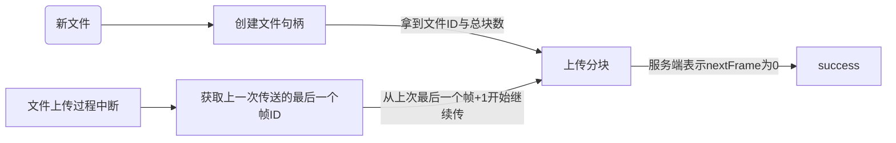

# KCos SDK Guidance

鉴于我们维护能力实在有限，无法为所有的编程语言都提供相对应的SDK，因此开源出来SDK的接口，各语言可以利用HttpClient构造请求来完成对应的功能。

访问接口就必须要在接口上附带X-AppId和X-AppKey字段，所有接口都要带上！后面所有的接口里不会再重复说明这个字段了。

## 用户管理

 Cos SDK的用户与调用方的客户ID是不一致的，需要用一个接口将这两个数据联系起来。只要客户提供一个userTag，服务端返回一个uint32类型的userId。

一个App底下的同一个userTag对应的userId是一致的，这个接口会返回一样的值。

```http
POST https://cos.kevinc.ltd:8082/user/createAppUser
```

### Request

```json
{
    "userTag":"xxxxxx"
}
```

### Response

```json
{
    "userTag": "xxxxxxxxx",
    "userId": 111111
}
```

## 文件管理

文件上传的流程，必须要先创建文件的句柄，拿到文件的分块信息后，再进行上传。



## 创建文件句柄

提交一些必要的元信息，用于创建文件的句柄。需要在头部附带UserId的信息。

```http
POST https://cos.kevinc.ltd:8082/file/createFileEntry

X-UserId 1111111
```

### Request

```json
{
    "path": "/yourParentPath/relatedPath",
    "fileNameWithExt": "file.ext",
    "fileSize": 11111111, // uint64类型
    "sha256": "xxxxxxxxxxxxxxxxxxx",
    "mimeType": "application/octet-stream", // 可不提供，默认值就是这个
    "deadLine": "2022-12-31T00:00:00.000+08:00", // 文件过期时间，可不提供，不提供默认永久有效
    "protection": 0, // 见下方文档说明，默认为0
    "securityPayload": ""
}
```

protection字段有4个取值：

0，表示文件公共读

1，域内可见（同一App下可见）

2，文件仅上传者自己可看

3，提供访问密码后可见。然后把密码字段写在securityPayload中。

4，向指定地址构造请求后可见，将指定地址写在securityPayload中，这个地址必须为有效的https链接，并且在地址中不可以附带query parameter。服务器会向这个地址发送一个post请求，结构如下。返回状态码为2xx时，会允许下载，其他情况则不允许下载。

```json
{
    "fileBelongsToUserTag": "xxxxxx",
    "fileBelongsToAppId": "xxxxxxxxxxxx",
    "visitorUserTag": "xxxx",
    "visitorAppId": "xxxxxxx",
    "visitorProvidedMessage": "xxxxx", //下载接口里的password字段可以被此处灵活使用
    "fileId": 11,
    "sha256": "xxxxxxxxxxx",
    "fileSize": "xxxxxxxxxxxxx",
    "mimeType": "application/octet-stream",
    "secret": "xxxxxxxxxx"
}
```

因为无法避免是不是有外人随便乱调用客户的服务器，因此客户收到请求之后，必须！！进行签名的校验！

其中的secret字段，是使用KCos服务器的RSA私钥加密的结果，生成规则如下：对fileBelongsToUserTag进行UTF8编码得到字节序列，对该字节序列使用RSA加密，加密后的字节序列，经过base64之后，即为secret的值。 

验证该字段请使用KCos对外公示的公钥。先将secret的值反base64，得到字节序列，将该字节序列使用RSA解密，解密后即得到了fileBelongsToUserTag的二进制表示。此时将fileBelongsToUserTag进行UTF8解码，对比json中附带的fileBelongsToUserTag，如果一致，就验证通过。

公钥如下：（可能会不定期更新）

```
-----BEGIN PUBLIC KEY-----
MIICIjANBgkqhkiG9w0BAQEFAAOCAg8AMIICCgKCAgEAuEitLDx0GHNxguMcLHT6
bM93xhBQBsrH+QeHDgCSJQrNsG+vaT/e4sJ8TY1MmDxrw549QW5i67GUrkQ6NDBp
VMzbYav4H9tVswOxYVO3N8DlNr2KyVS4t5VTWigEVgenUgVa6F0wBdus/lR4HbEV
2tlV8ATysVt2MrOUQJopDhUUqnqOswHzKxTRPypkhmvOhvdbWFnLUEXopMrPOJNf
tiroAljhh4QPoKYVtg8galDHaIoLRXC3q3Vle9q6PKNnq3ZPQlxWQ/dPz7B/kcQl
hk1VBRN9YW4mdZyRqkCTyRf3smyYcErZnw4GHJ3AcaLq0ERAqbSwSSlkI/1cGKkn
2R4A6YIpNTyZ+tktfuxQOBlQ/tv8YPmEEI7fP9RERFHuKbZTnaUs8qf3YnXutV3P
7vO0F7fW/7beDdK5EwyhHKm3mPnpmuoBKLh8IXZUrgEfsAeFQ9nBeDjXcI2gg18R
8lCOFNCvcYosb51lmFUed2T8vnWleKFKPZeF/0L0mkG85OQwd4K3CG1I+bmokk7S
1K/rP6hnamGCdIFwy8fMNDz7UmTBTH6Qrrxf6BdAeWwkxW7wtjRAgwerOWN+Nf2/
zjK4puH029/+amI9cHRAz5wCFv6zhEYtwYzvL4XiAS/s9NVVFBoi+fwtdqgtRifX
ferbdmb9JUYR9pBxpasMYt8CAwEAAQ==
-----END PUBLIC KEY-----
```

### Response

```json
{
    "id": 37, // 文件Id，非常重要，需要保存下来，uint64类型
    "fileSize": 11111111,
    "frames": 11, // 文件分块的数量
    "nextRequestedFrame": 1, // 见文档
    "pathHierarchy": [
        "yourParentPath",
        "relatedPath"
    ],
    "fileNameWithExt": "file.ext",
    "creationTime": "2022-09-29T15:17:49.0336106+00:00",
    "deadLine": "2022-12-31T00:00:00+08:00"
}
```

nextRequestedFrame表示下一次需要进行传送的帧标号。是一个uint32类型，若这个值是0，表示这个文件的二进制已经在系统中出现过了，会重复利用，而无需浪费流量进行传送。

## 上传文件块

将文件分为1MB的包，进行发送，每个文件块最大1MB。

```http
PUT https://cos.kevinc.ltd:8082/file/upload?fileId=xxx&seqNumber=1

X-UserId 1111111
```

seqNumber表示文件块的顺序，以1为基准，每个包大小为1MB（除了最后一个包可以不是）请求体就直接放二进制就行了

### Response

```json
{
    "nextRequestedFrame": 2
}
```

nextRequestedFrame表示下一次需要进行传送的帧标号。是一个uint32类型，若这个值是0，表示传输过程已经结束了

## 获取上传断点

由于可能出现各种各样的问题导致上传中断，因此当上传中断时，可以通过该接口获取到上一次的断点文件块ID

```http
GET https://cos.kevinc.ltd:8082/file/lastFrameSeqNumber?fileId=xxxx
```

注意！此接口返回的是上一个成功上传的包的ID，那么下一个应该传的包，是这个接口获取到的ID + 1

接口返回值比较粗暴：

状态码400时，表示这个文件无需继续上传。

状态200时，ResponseBody直接就是一个数字（没有Json，没有任何结构），表示上一个成功上传的包的序列号
